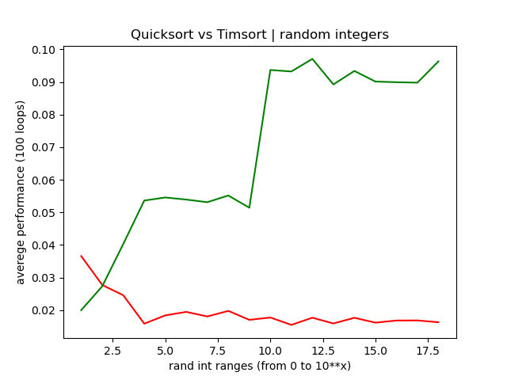

# Сортировка с минимальным процессорным временем

__Задание:__
На языке Python реализовать функцию, которая быстрее всего (по процессорным тикам) отсортирует данный ей массив чисел. Массив может быть любого размера со случайным порядком чисел (в том числе и отсортированным). Объяснить почему вы считаете, что функция соответствует заданным критериям.


__Решение:__
Самым быстрым способом отсортировать массив чисел - будет воспользоваться фунцией sort из библиотеки numpy.

```py
import numpy

array = numpy.array(somelist, numpy.int64)
array.sort()
```
Используемый по умолчанию алгоритм функции numpy.ndarray.sort хорошо оптимизирован и использует комбинации mergesort, quicksort/introsort, timsort в зависимости от того какую производительность в процессе сортировки показывает алгоритм.

Массиву можно задать ограничение по типу значений, что может ускорить сортировку в десятки, если не в сотни раз.

Но задание, как я понял - реализовать функцию. Поэтому для реализации я выбирал между countsort, radixsort, binary insertionsort, mergesort, quicksort.

__Radixsort__ занимает в среднем $O(nk)$ операций, где $k$ (число разрядов) может быть больше $\log n$, так как размеры целых чисел в python ограничены только размером памяти. В этом случае он покажет эффективность худшую, чем mergesort. Почему-то работает медленнее, чем mergesort на массивах, которые описаны ниже.

__Insertionsort__ эмпирические исследования показали, что он эффективен для массивов длинной <= 64 элемента. Поэтому timsort использует его вариацию с бинарным поиском для своих "минимальных прогонов" длинной 32, 64 элемента.

__Mergesort__ занимает $O(n \log n)$ операций в любом случае, за что считается одним из наиболее эффективных негибридных алгоритмов сортиовки на основе сравнения. Но на практике, в среднем, уступает по скорости quicksort.

__Quicksort__ Прост в реализации. Занимает в среднем $O(n \log n)$ операций. Но, худший случай $O(n^2)$! Хоть на практике и редко встречается со случайными числами, на сортированных или частично-сортированных массивах ничем не лучше bubblesort. Другое слабое место - рекурсия, глубина которой может переполнить стэк, елси массив неудачный.

Я решил попытаться устранить недостатки quicksort.
1. Если размер массива для сортировки меньше или равен 64 элементам - пусть его сортирует insertionsort.
2. Если глубина рекурсии > $2 * \log n$ пусть остаток досортирует модифицированный mergesort, который тоже использует insertionsort для массивов <= 64, чтобы снизить колличество рекуррентных вызовов.

Для наглядности я реализовал этот алгоритм на cython, чтобы сравнить его производительность с timsort - родным алгоритмом сортировки в python. На моей машине в среднем он немного быстрей :)

Сравниваются модифицированный quicksort и родной python timsort.
Для каждого сравнения я запустил цикл на 100 итераций, который считает среднюю скорость сортировки массива размером $10^4$ элементов со случайными целыми числами в нескольких диапазонах: $0 .. 10^1, 0 .. 10^2, ..., 0 .. 10^{18}$. Каждую итерацию выполняется проверка на равенство массивов. В случае неравенства выводится сообщение.




```
quicksort 0.0018053608800983056
timsort 0.0013809100601065438
- timsort is 1.31 times faster on range 0..10^4 with rand ints from 0..10^1

quicksort 0.002555641709768679
timsort 0.0031247851695661664
+ quicksort is 1.22 times faster on range 0..10^4 with rand ints from 0..10^2

quicksort 0.002109905860197614
timsort 0.0039877946500928374
+ quicksort is 1.89 times faster on range 0..10^4 with rand ints from 0..10^3

quicksort 0.0009262771701469319
timsort 0.0037748052502138306
+ quicksort is 4.08 times faster on range 0..10^4 with rand ints from 0..10^4

quicksort 0.0015618230901600328
timsort 0.003200845630490221
+ quicksort is 2.05 times faster on range 0..10^4 with rand ints from 0..10^5

quicksort 0.0016071080501569668
timsort 0.0034488544301711954
+ quicksort is 2.15 times faster on range 0..10^4 with rand ints from 0..10^6

quicksort 0.0017851169400819344
timsort 0.0037300805599079466
+ quicksort is 2.09 times faster on range 0..10^4 with rand ints from 0..10^7

quicksort 0.001436145820116508
timsort 0.00267056791955838
+ quicksort is 1.86 times faster on range 0..10^4 with rand ints from 0..10^8

quicksort 0.0012480055304331472
timsort 0.0033246636500552994
+ quicksort is 2.66 times faster on range 0..10^4 with rand ints from 0..10^9

quicksort 0.0018128994099242846
timsort 0.006448745769957896
+ quicksort is 3.56 times faster on range 0..10^4 with rand ints from 0..10^10

quicksort 0.0014397852504771437
timsort 0.006607724569767015
+ quicksort is 4.59 times faster on range 0..10^4 with rand ints from 0..10^11

quicksort 0.0009403749992634402
timsort 0.005736008989915717
+ quicksort is 6.1 times faster on range 0..10^4 with rand ints from 0..10^12

quicksort 0.0016016236097493675
timsort 0.005548217869727523
+ quicksort is 3.46 times faster on range 0..10^4 with rand ints from 0..10^13

quicksort 0.0008362782094627619
timsort 0.005173439130157931
+ quicksort is 6.19 times faster on range 0..10^4 with rand ints from 0..10^14

quicksort 0.0014736096099659335
timsort 0.006244044050254161
+ quicksort is 4.24 times faster on range 0..10^4 with rand ints from 0..10^15

quicksort 0.0012903679595910945
timsort 0.0067453276203741554
+ quicksort is 5.23 times faster on range 0..10^4 with rand ints from 0..10^16

quicksort 0.0012967575502261753
timsort 0.005180133119574748
+ quicksort is 3.99 times faster on range 0..10^4 with rand ints from 0..10^17

quicksort 0.0013652116802404634
timsort 0.0060516853100125445
+ quicksort is 4.43 times faster on range 0..10^4 with rand ints from 0..10^18
```

Модифицированный quicksort работает быстрее timsort в вышеупомянутых условиях, но проигрывает на отсортированных и почти отсортированных массивах. Тем не менее проигрывает значительно меньше, чем quicksort без модификаций.

Ну и, конечно, это медленее, чем numpy.ndarray.sort.


---

Чтобы запустить копиляцию и тесты выполните:
```
python run.py
```